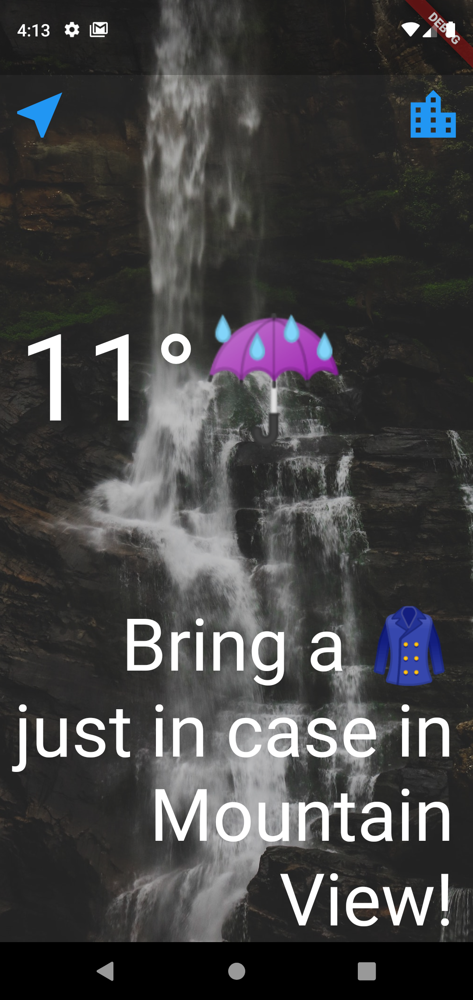
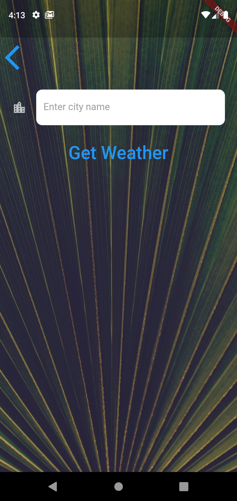

# Clima  

A weather App that gives the weather condition of your current location. It also gets condition of inputted location. 

Star⭐ the repo if you like what you see😉.

## 📸 ScreenShots

| 1 | 2|
|------|-------|
|||

| 3 | 4|
|------|-------|
|||

## ✨ Requirements
* Any Operating System (ie. MacOS X, Linux, Windows)
* Any IDE with Flutter SDK installed (ie. IntelliJ, Android Studio, VSCode etc)
* knowledge of Dart and Flutter
* API integration (CoinApi.io)
* A brain to think 🤓🤓

## 🤓 Author(s)
**Fadowo Michael** 

